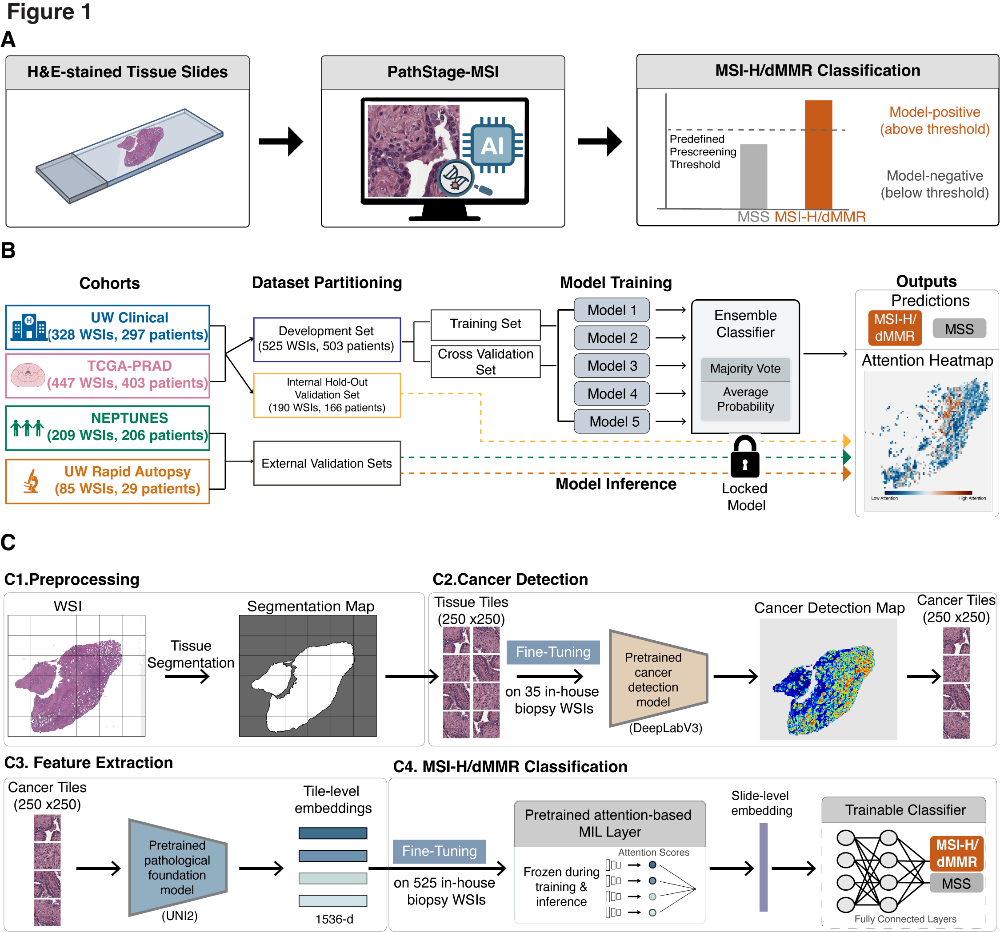

# Image-based Detection of Mismatch Repair Deficiency in Prostate Cancer Using Transfer Learning


## 📋 Overview

This repository provides a step-by-step workflow for histopathology data analysis, from tile extraction and cancer detection to feature extraction, and MSI prediction, and additional exploratory analyses.

<p align="center">
  
</p>

---
## 📚 Table of Contents

- [🚀 Getting Started](#-getting-started)
  - [Clone the Repository](#clone-the-repository)
  - [Environment Setup (Example)](#environment-setup-example)

- [🧬 Mutation Prediction Pipeline](#-i-mutation-prediction-pipeline)
  - [Step 1 – Extract Tiles from WSI](#step-1-extract-tiles-from-wsi)
  - [Step 2 – Run Cancer Detection](#step-2-run-cancer-detection)
  - [Step 3 – Generate Embeddings](#step-3-generate-embeddings)
  - [Step 4 – Run Inference for MSI-H/dMMR Prediction](#step-4-run-inference-for-mutation-prediction)
  - [Step 5 – Evaluate Model Performance](#step-5-evaluate-model-performance)
 
---

## 🚀 Getting Started
### Clone the repository

```bash
git clone https://github.com/lucasliu0928/PathStageMSI.git
cd PathStageMSI
```

### Environment Setup
#### For Cancer Detection
```
conda env create -f env_files/paimg9.yml
conda activate paimg9
```

#### For MSI Prediction:
```
conda env create -f env_files/mil.yml
conda activate mil
```

## Main Dependencies
* For cancer detection
   - Python 3.8.20  [GCC 13.3.0]
   - cv2 == 4.10.0
   - fastai == 2.7.10
   - torch == 2.4.1+cu121
   - torchvision == 0.19.1+cu121
   - openslide == 1.3.1
   - histomicstk == 1.3.14 (python -m pip install histomicstk --find-links https://girder.github.io/large_image_wheels)
* For MSI prediction
  - Python 3.9.23 [GCC 13.3.0]
  - torch == 2.8.0
  - torchvision == 0.23.0
  - pandas == 2.3.2
  - numpy == 1.26.4
  - scipy == 1.13.1
  - scikit-learn == 1.6.1
  - h5py == 3.14.0
  - tqdm == 4.67.1
  - nystrom-attention == 0.0.14
  - einops == 0.8.1


## 🧬 Mutation Prediction Pipeline

### Step 1: Extract Tiles from WSI

This step processes the Whole Slide Image (WSI) into tiles (e.g., keeping tiles with tissue coverage > 0.9 and white space < 0.9).

```bash
conda activate paimg9
cd cancer_detection_final
python3 -u 1_extract_patches_fixed-res.py \
  --cohort_name TCGA_PRAD \
  --pixel_overlap 0
```

**Generated output:**
- `sampleid_tiles.csv`    — Metadata of the extracted tiles containing white space % and tissue coverage %
- `sampleid_low-res.png`  — Low-resolution WSI image  
- `sampleid_tissue.png`   — Detected tissue mask image
- `sampleid_tissue.json`  — Tissue region annotations  
---


### Step 2: Run Cancer Detection

This step applies a trained cancer detection model to the extracted tiles.

```
conda activate paimg9
cd cancer_detection_final
python3 -u 2_cancer_inference_fixed-res.py --cohort_name TCGA_PRAD  --fine_tuned_model True --pixel_overlap 0 
```

**Generated output:**
- `sampleid_TILE_TUMOR_PERC.csv` — Tile-level cancer probability and metadata  
- `sampleid_cancer_prob.jpeg` — Cancer prediction probability heatmap  
- `TILE_@#_X#Y#_TF#.png` — Top 5 tiles with the highest tumor fraction  
  - `@#`: Magnification level  
  - `X#`, `Y#`: Tile coordinates  
  - `TF`: Tumor fraction score  
- `sampleid_cancer.json` — Cancer region annotations
  


### Step 3: Generate Embeddings

This step uses selected foundation models to compute tile-level embeddings. 

```
conda activate paimg9
cd cancer_detection_final
python3 -u 4_get_feature.py --cohort_name TCGA_PRAD --pixel_overlap 0 --fine_tuned_model True --feature_extraction_method uni2
```

**Suuported models:** `retccl`, `uni1`, `uni2`, `prov_gigapath`, `virchow2`.
**Generated output:**
- `sampleid/features_alltiles_modelname.h5` — Tile-level embedding features  
  - `modelname`: One of `retccl`, `uni1`, `uni2`, `prov_gigapath`, `virchow2`
    

### Step 4: Run Inference for MSI-H/dMMR Prediction

This step runs locked models for MSI prediction.

```bash
conda activate mil
cd PathStageMSI

python3 -u inference/inference.py \
  --test_data /path/to/test_data.pth \
  --model_dir locked_models \
  --output_dir output/predictions \
  --output_subdir none \
  --threshold_csv configs/thresholds_summary.csv \
  --logit_priors_csv configs/logit_priors_summary.csv \
  --folds all \
  --cuda_device auto
```

### Step 5: Evaluate Model Performance
If ground-truth labels are available in the prediction CSV, compute bootstrap confidence intervals:

```bash
python inference/bootstrap_performance.py \
  --prediction_csv output/predictions/ensemble_prediction.csv \
  --output_csv output/predictions/bootstrap_performance.csv \
  --cohort_name test
```


    
## Authors
Lucas J. Liu 
jliu6@fredhutch.org

## Version History
* 0.1
    * Initial Release


